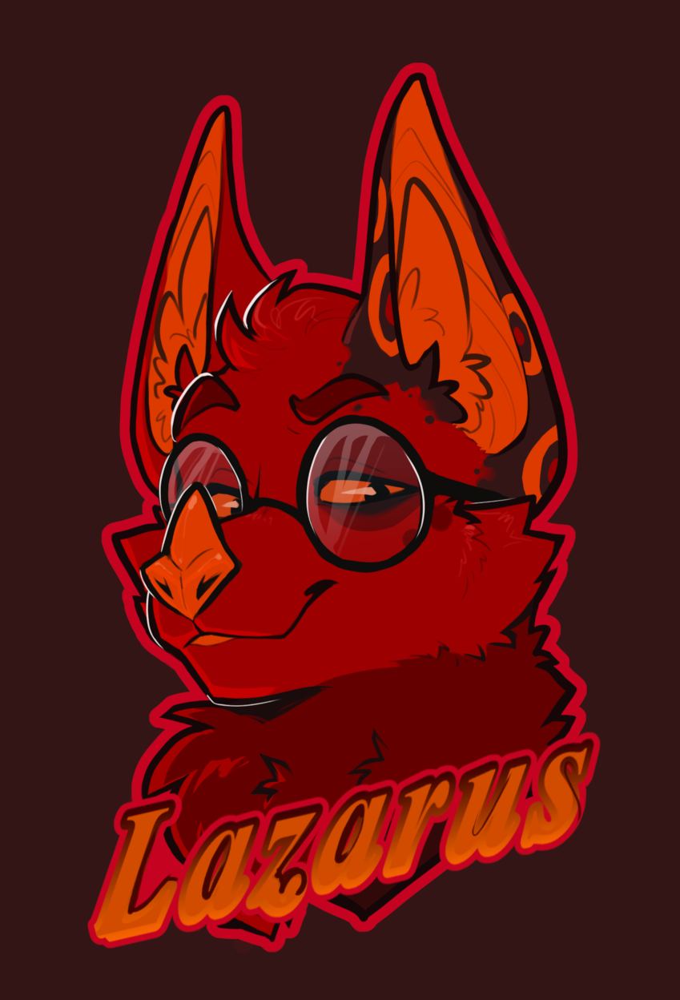
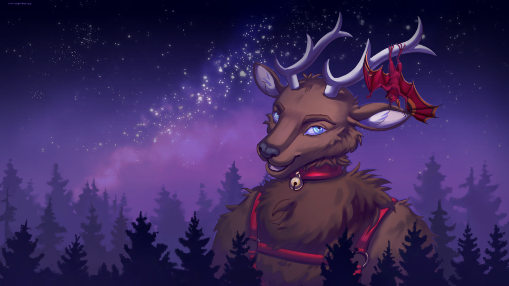
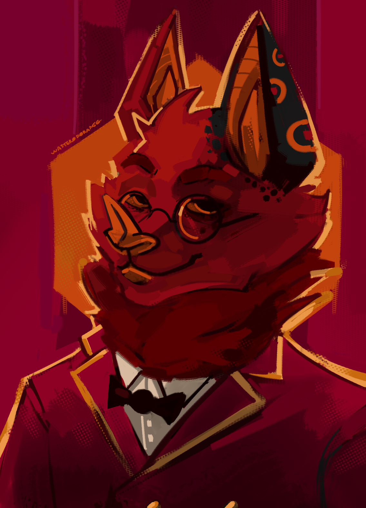
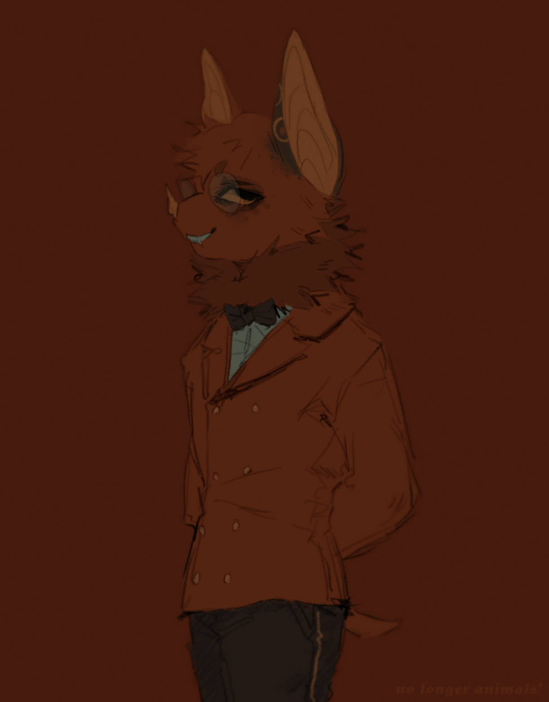
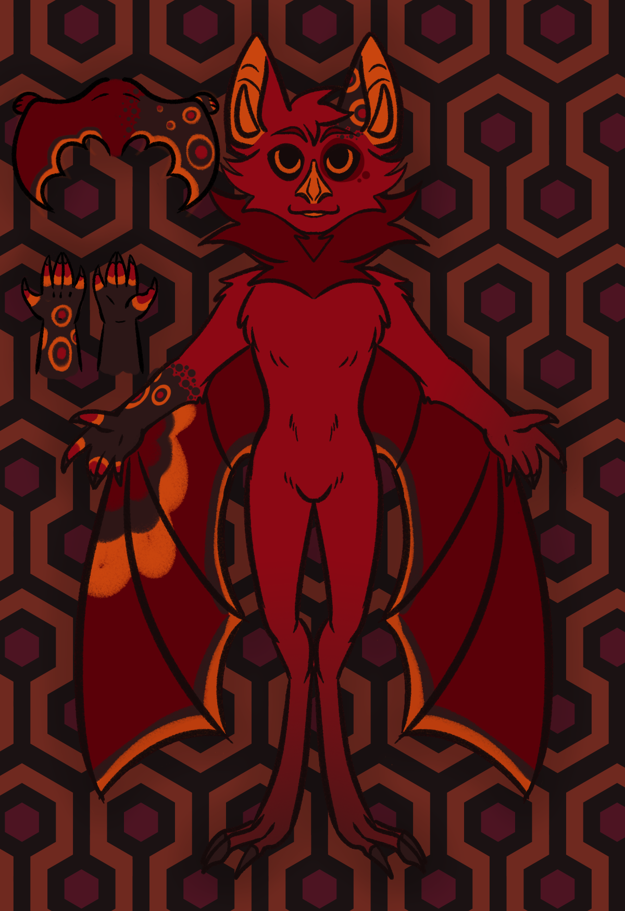
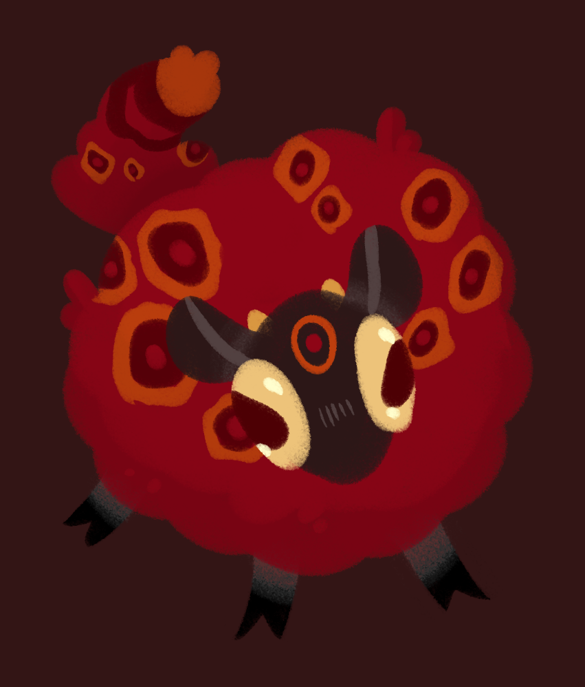
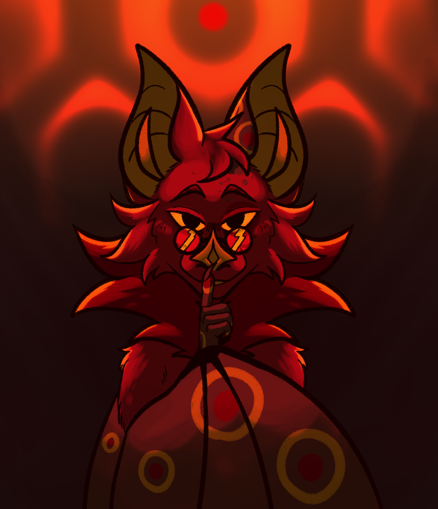

# hello


	
	
	
	
	
	
	
	


# Reference

**Gender:**
Male

**Age:**
23

**Species:**
[Leaf-nosed bat](https://en.wikipedia.org/wiki/Leaf-nosed_bat)

**Personality:**
[INFJ](https://www.16personalities.com/infj-personality)

**Identifiers:**
He/Him, Furry, [Autoromantic](https://lgbtqia.wiki/wiki/Autoromantic), [Polyamorous](https://lgbtqia.wiki/wiki/Polyamorous)

**Interests:**
- Software Development
- Story Telling
- Culture and Folklore
- Art Analysis
- Furries and the LGBTQ Community
- Linux and Operating Systems
- Political Science and Philosophy

**Favorite Games:**
- Prey (2017)
- Elden Ring
- The Elder Scrolls II: Daggerfall
- Cave Story
- Hollow Knight
- Dwarf Fortress
- Dark Souls I

**Favorite Movies:**
- [Here is my Letterboxd.](https://letterboxd.com/moowool/films/)

**Favorite Songs:**
- [Here is my playlist.](https://music.youtube.com/playlist?list=PLkeuL5BvmN-CIk-OFzZ0hFb85-GJ4k1w6&si=wKOGKP7bWDg6DbK6)

**Favorite Paitings:**
- [Isle of the Dead](https://upload.wikimedia.org/wikipedia/commons/d/de/Arnold_B%C3%B6cklin_-_Die_Toteninsel_I_%28Basel%2C_Kunstmuseum%29.jpg): "Basel" version, 1880, Arnold Böcklin
- [The Apparition](https://upload.wikimedia.org/wikipedia/commons/e/e0/Gustave_Moreau_-_l%27Apparition.jpg): "oil on canvas" version, 1876-1877, Gustave Moreau
- [Deianira](https://upload.wikimedia.org/wikipedia/commons/0/0b/Gustave_Moreau_-_Dejanira_%28Autumn%29_-_84.PB.682_-_J._Paul_Getty_Museum.jpg), Autumn, 1872, Gustave Moreau
- [The Cyclops](https://upload.wikimedia.org/wikipedia/commons/b/be/Odilon_Redon_-_The_Cyclops%2C_c._1914.jpg), 1898-1914, Odilon Redon

**Favorite Programming Languages:**
- C
- Go
- Lisp
- Lua
