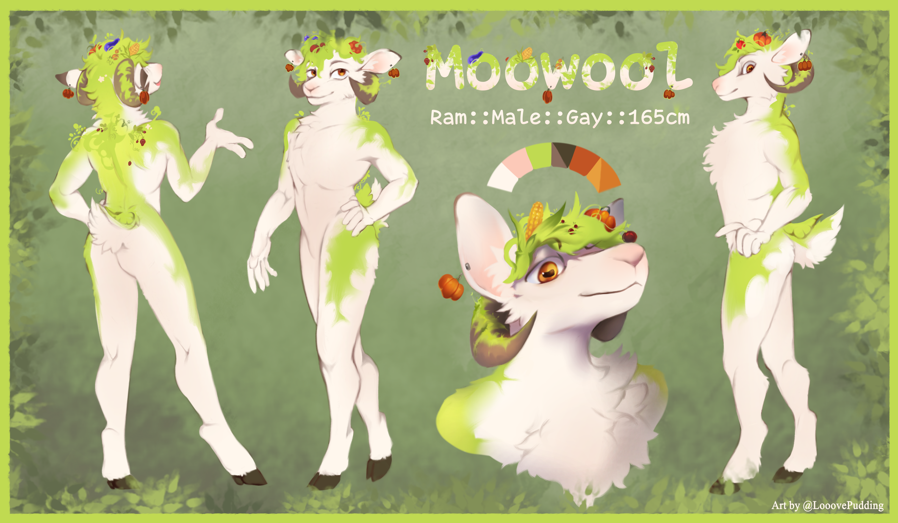

## Fursona
Moowool L. Summerwheat is a floral sheep of the salad variety. He is 165cm tall, exactly my IRL height. His eyes are amber, his wool is cream and his dorsal coating is lime. On his back and hair, which are made of salad grows vegetation with a side of fruits and vegetables. He has brown forward-curving horns, humanoid hands and digitigrade hooved legs.

## Contacts
 Discord: Moowool#2857

 Telegram: [@Moowool](https://t.me/Moowool)

 Email: [moowool195@gmail.com](mailto:moowool195@gmail.com)

 Doomworld: [Spowmtom](https://www.doomworld.com/profile/30159-spowmtom/)
## Donations
 BTC: [bc1qfs8mgrptfnnev3m4x5gslhc7t363t50fcpgafd](btc.png)

 ETH: [0xF36b7d60CCb55BBDb911fc98DdB151A5d03C538e](eth.png)

 BCH: [qpxc8wn8mj0ej7n2jg4radqdszx8yar6cvr0n4paa2](bch.png)

 XMR: [45g6AgnufERYeaRVXYvvR3Mpay9CpJ4EKWQPyJM7Bz
4G7h6PW29bHrT8CMTzhmsiKijVrpovxGTJDXXftfR4i5kR295jz3a](xmr.png)

## GPG Keys
You can either download the file or pipe its output to `gpg(1)`

*  [GPG key](moowool.pgp)

*  `curl https://moowool.info/about/moowool.pgp | gpg --import`
