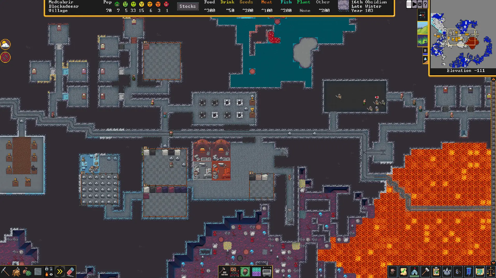
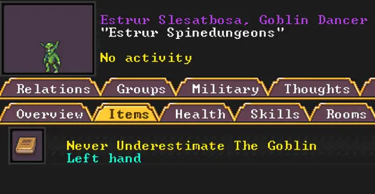
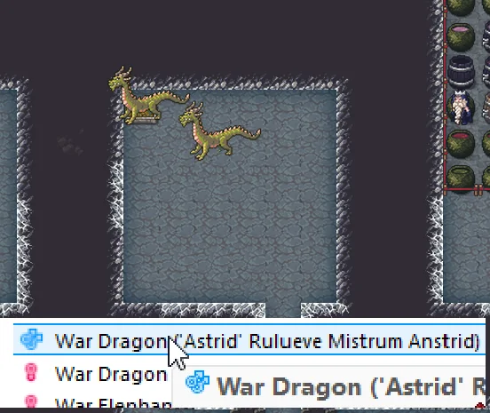
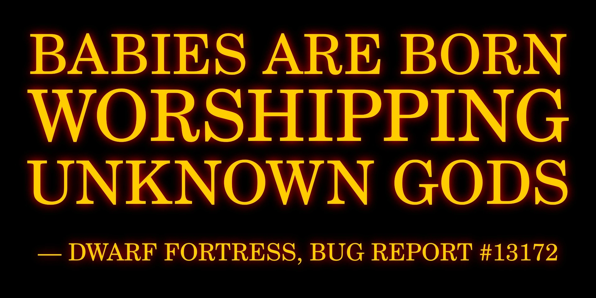

This is, hands down, one of the best games you can play right now. There is absolutely nothing that exists which is remotely like Dwarf Fortress. This game will expand what you think a game can be, and even then, I'm underselling it. The sheer unfiltered depth of this game is breathtaking. I am 348 hours deep into it, and it feels like I've just started.

This game was the direct inspiration for Minecraft, Rimworld, Factorio, among many other gaming giants, and while all these games bring something special, none quite capture what Dwarf Fortress can bring.

## A Story Generator

Dwarf Fortress is a story generation game wearing the coat of a colony sim. Your creativity reigns supreme, and Dwarf Fortress does everything in its power to bring you dynamic storylines, chaos, and hilarious or terrifying situations. This is where many games, like Minecraft, falter because their core philosophy is to only ever react to the player. This creates static worlds where nothing ever happens and where being creative is unexiting and emotionally taxing, but Dwarf Fortress's worlds feel alive, dynamic, and chaotic in ways I have never seen before or since in a game.

Here is an example of a real and genuinely gripping story a player experienced long ago, the story of [The Hamlet of Tyranny](https://1d6chan.miraheze.org/wiki/The_Hamlet_of_Tyranny).

> Deep beneath the fortress of the Hamlet of Tyranny lay a sleeping horror: Ashmalice, a legendary fire demon with over 550 kills and the blood of a king on his hands. When careless miners breached his prison, the demon and his horde poured into the mountain fortress like a plague, and the once-prosperous dwarven civilization crumbled in weeks.
>
> The blacksmith Stuvok, grief-stricken after his wife Doken fell to Ashmalice, channeled his sorrow into a masterpiece of an artifact sword. He named it "Endless Death of Tears," and though Stuvok himself would fall in the final defense, the legendary captain Daneken took up the blade with nothing left to lose. At the edge of a vast chasm, with demonic flames scorching his flesh and his people's last hope hanging by a thread, Daneken seized his moment and drove the artifact deep into Ashmalice's heart, casting the demon into the darkness below. The fortress fell silent.
>
> Nearly all were dead, save for one: Sil the engraver, broken and alone on a distant ledge. And there, bleeding out in the shadows, Sil carved one final image: a demon cowering in fear, surrounded by dwarves who laughed in triumph. A last defiant jest at death itself.

You don't see that ever happening in Minecraft, eh?

### Dwarven Humor

The chaos can also create hilarious results. For instance, here's a player who received a butt-naked goblin dancer in his fortress save for a book called "Never Underestimate the Goblin." Props to [InterestedRedditer on Reddit](https://www.reddit.com/r/dwarffortress/comments/ztv9kg/a_goblin_came_to_visit_my_tavern_buttnaked_save/) for this wondrous find.

Or user [actuallylikespitbull on Reddit](https://www.reddit.com/r/dwarffortress/comments/1jtjo89/i_was_so_excited_to_finally_have_a_breeding_pair/) who was so excited to finally have a pair of dragons to breed, only to wait 11 years to realize the male was gay.

And last but not least, some bug reports are genuinely hilarious, like this one from [SS_beny237 on Reddit](https://www.reddit.com/r/dwarffortress/comments/1oxdxuu/babies_are_born_worshipping_unknown_gods_is_one/).

## But Isn't Dwarf Fortress Impenetrable for Newcomers?

Don't be worried about people calling this the "most difficult game to play ever." While it definitely has its rough edges (still in Alpha), it's nothing a quick 30-minute YouTube video can't fix. I recommend watching "THE ULTIMATE GUIDE TO DWARF FORTRESS" by [VonGalactic](https://www.youtube.com/@VonGalactic) and having the [wiki](https://dwarffortresswiki.org/index.php/Main_Page) open if you need it, and you'll be golden.



Also, the whole ASCII graphics thing is not in the [Steam version](https://store.steampowered.com/app/975370/Dwarf_Fortress/), you have actual graphics and music, there. Although, you can enable ASCII graphics if you want to vibe it out.


Fair warning: this game is menu-heavy. If you like real-time immediate gameplay like Minecraft, then this may not be for you, but the game is truly interactive. It is not an idle or tycoon-kind of game.


Speaking of this game still being in Alpha, that's actually a feature, in my opinion! The game is alive and getting frequent and huge updates. If you were there in the early Minecraft days, this game still feels like that. There is a real sense of constant excitement in the community about the development of this game, and the updates feel substantial. This has been ongoing for almost 20 years with no signs of stopping!

## Modes of Play

This game comes with three modes of play: [Fortress Mode](https://dwarffortresswiki.org/index.php/Dwarf_fortress_mode) (the crux of the game), Legends Mode (an exhaustive log of every event, location, character, storyline, etc. of your generated worlds), and Adventure Mode. I won't explain Fortress Mode since the video I recommended above should do more than a good job of it.

[Legends Mode](https://dwarffortresswiki.org/index.php/Legends), while not interactive, has tremendous value. If you play D&D, you can generate an entire world and use Legends Mode for your campaigns, or you can find inspiration in the logs for your next fantasy novel! It's also great for understanding what's actually happening in your world, where your dwarves come from, and who the major powers in your world are. It's easy to get lost in Legends Mode, and it's a welcomed, light addition to the game.

[Adventure Mode](https://dwarffortresswiki.org/index.php/Adventurer_mode) is where my feelings for the game become complicated. In this mode, instead of managing a colony, you directly control a single character who has access to your entire world, including your existing fortresses. The premise is absolutely fantastic, play a role in your world, but in practice, the mode lacks major interactive features such as complex relationships, being a productive member of an existing fortress, fulfilling internal goals, or any sort of building mechanic. Improvements to the mode are planned but not in the foreseeable future. If the core premise sounds exciting to you, I recommend trying out another one of [Kitfox](https://www.kitfoxgames.com/en)'s games, [Caves of Qud](https://store.steampowered.com/app/333640/Caves_of_Qud/).

## Conclusion

Overall, Dwarf Fortress can easily become one of your most cherished gaming experiences. Call on Urist to grab his pickaxe, and **Strike the Earth!**
