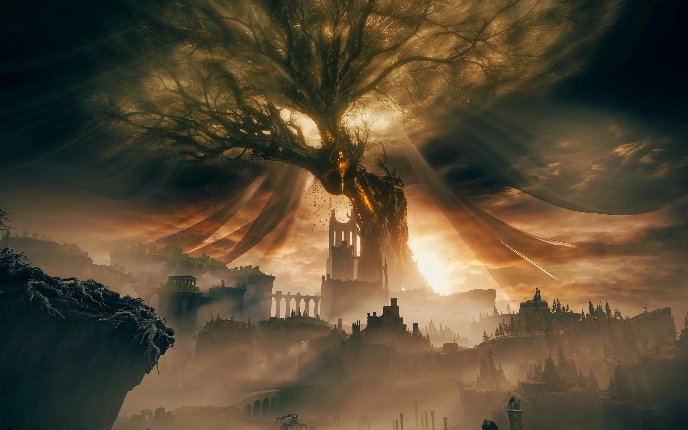

## A Tarnished of No Renown

before diving into this review of Elden Ring: Shadow of the Erdtree (SOTE), I believe it is important to establish who I am in relation to Elden Ring.

Due to its nature as an RPG, Elden Ring greatly values player expression, allowing for many different builds and playstyles. Players going through the game for the first time will have a different experience than someone on their fifth playthrough, some might aim to 100% the game while others speedrun the game to become Elden Lord in record time, and some players will use every tool at their disposal to defeat the difficult bosses while others will artificially restrict themselves to only one weapon to develop a deep understanding of that weapon.

If my relationship with the game feels foreign to you, it is likely that what I consider "deal breakers" is merely an annoyance for you.

I'm Lazarus, I must have completed more than one hundred full Elden Ring playthroughs, tried most weapons and all playstyles. I have also achieved many challenge run, the most recent one begin a true level 1 run where I am forbidden from levelling up or using items and talismans artificially increasing my levels. I have also done a +0 longsword playthrough, multiple playthrough only using a single weapon class for dealing damage, stat-only playthroughs for each stat, and X elemental damage only for each element. I have been in love with Elden Ring for more than two years. I watch Elden Ring weapon and spell analyses daily, am I am heavily invested in the lore and consider it one of my favorite stories. Elden Ring was one of my biggest inspiration for becoming a hobbyist writer.

But it has not always been like this, I considered Elden Ring to be a really bad game for my first five playthroughs. I did not enjoy my first experiences and felt frustrated and misguided, but I slowly developed an understanding for how the game wants to be played. This isn't an Elden Ring review, but I consider the game's biggest fault to be obtuse, it is awful at teaching the player how to play it. But once you learn, this game will never leave you.

I haven't had a great experience with my first playthrough of SOTE, but I assumed I had to undergo the same journey I did with the base game. After five fully completed playthroughs, I realized my problems with it were entirely different than with the base game. But unlike with it, there is nothing I can do to address the issues.

## The Fading Flame of Ambition

What I consider to be the biggest issue plaguing Shadow of the Erdtree (SOTE) is the lack of extrinsic rewards.

As a reminder, extrinsic rewards are tangible and come from concrete goals, for instance Elden Ring rewards the player after defeating the Tree Sentinel with the Golden Halberd and some runes. By contrast intrinsic rewards are subjective and come from experiencing something special, for example the player may feel a sense of wonder and amazement at the first sight of Limgrave bathed in the towering Erdtree's light accompanied with the area's soothing ambience.

While I felt SOTE delivered with the intrinsic rewards (which I will get to in the [next section](#a-sight-of-grace), it had some serious issues with extrinsic rewards which in my opinion completely ruined the entire experience.

The most impactful manifestation of this problem is the DLC's placement in a full playthrough. To access the DLC, the tarnished must defeat Mogh, an optional end-game boss that to reach he requires defeating three Demigods, the main boss of Castle Sol, and to traverse five of the six open world areas. Although there is a way to reach Mogh by defeating one Demigod and doing Varre's quest, most players would not want to do that considering his end-game scaling as he is designed to be one of the last demigods the tarnish fights.

So, by the time the player can enter the DLC, they are just a few boss fights away from becoming Elden Lord. The player is already fully equipped to finish the game and have played through most of the game's content. They have their favorite weapons maxed out, their skill points allocated into the perfect bill up to the softcaps, their flasks maxed out, and their skills owned. The player's satisfying ending to their playthrough is at their fingertips, so what extrinsic rewards could entice the player to engage in a DLC half the size of the original game?

The DLC has nothing to offer the player to further their build. The vast majority of weapons in the DLC either match in power the ones found in the base game, or are shadowed by them. There are some exceptions, though. From my time with all of the DLC's weapons, here are all of the 70 weapons I consider to outclass the ones found in the base game:

- Ancient Meteoric Ore Greatsword
- Sword Lance
- Falx
- Euporia
- Bloodfiend's Arm
- Messmer Soldier's Spear

These weapons aren't required to have an easy time with Elden Ring's end game, and I would argue that the 64 other ones can only be viable or fun at best. For some players, that's all the motivation they need to want to go through the DLC, but for me, I don't consider the hours long trek to be worth the effort.

For the curious ones, here are the of the 42 DLC spells I consider to outclass the ones found in the base game:
- Knight's Lightning Spear
- Pest-Thread Spears
- Heal from Afar
- Blades of Stone
- Fleeting Microcosm

Again, in my experience, these are only marginally better than the ones found in the base game.


**Note:** If a weapon or spell you like is not listed here, I do not consider it bad. This list is only for items I find better than what's found in the base game.


Evaluating each weapon, item, and spell is out of the scope of this review. For those who are interested, I recommend watching my favorite Elden Ring YouTuber: [Youwy](https://www.youtube.com/@youwy).



## A Sight of Grace

## Mending the Elden Ring

<!-- My issues with the game:
- No reason to play since it's post end game and finishing it has no
  consequences outside of the land of shadows
- There is no character progression past the end game because the flask is maxed
  out, and there are very few weapons, spells or items that outlcass what's
  found in the base game. Levels don't matter anymore.
- Scadutree fragments are boring to forage because they all matter in contrast
  to golden seeds. They could have helped with post end-game progression, but
  there is literally nothing else in the game to push progression further
- Most bosses are so out of my way, I don't even care for fighting them. In the
  original game, the player has to fight two rune bearer and they have the
  choice, afterwards 7 bosses are required to beat the game. In SOTE, only 3
  bosses total are required to finish the DLC. Since there is no reason to fight
  any other boss, I don't really want to
- I personally did not like the bossses (dancing lion is hard to read,
  putrescent knight is underwhelming, the boar guy is really fun to fight but
  requires Vow of the Indomitable, the flower is too easy and anti-climactic,
  radahn is one of the worst bosses ever (reference the video on the subject)
- The lore is underwhelming and lackluster
- Furnace Golems are extremely boring to fight
- There are so many totally empty areas, it makes me want not to explore the
  open world (along with no character progression)
- The DLC is super short (just need to beat Messmer, Saint of the Bud, and
  Consort Radahn)
- Most of the development effort were spent on Shadowkeep, so the other legacy
  dungeons are small and don't have much content or brenching paths

Good things to say:
- I love the characters in the DLC
- The soundtrack is one of the best in FS's history
- The little bit of lore we had is quite nice and reflects the themes of Elden
  Rig perfectly and deepens them
- Some areas look fantastic
- Shadowkeep is a great dungeon, even if I did not personally like it
- The smaller overworld dungeons looked a lot better than the base game and were
  bigger and more intricate, I liked it
- CURSE YOU, BAYYYYYYYYYLE

Explore why I find the DLC to be one of my worse gaming experiences while others
say it's one of the bests

How to fix the DLC? Must be cheap to do, no creating mass assets, no redesigning
entire areas or no adding new dungeons and bosses Put the DLC at the beginning
of the game and scale the items and enemies accordingly Make beating the DLC
lead to the end of the base game Either replace scadutree fragments with golden
seeds and sacred tears OR rework the scadutree fragments like making them have
an effect outside of the land of shadows only once Consort Radahn is defeated
-->
