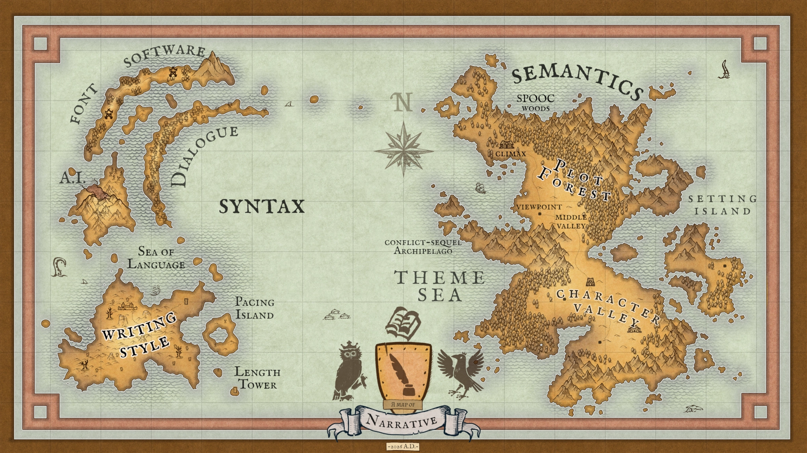

<!-- Download button -->
<a href="/posts/literally-everything-about-creative-writing/map_of_narrative.webp" download="map_of_narrative.webp">
	<button class="cute-button">
		Download Map
	</button>
</a>

## What this talk is about

- Learn what stories are made from
- Develop a mental map for when you write your own stories and read writing advice books
- Give you resources to help you write (some made by me, some not)
- Learn my world view of stories (this talk is subjective, you can disagree)
- I tried to choose examples that will speak to the community. If you don't know some of the things I'm referencing, it's okay
- Probably no questions near the end, feel free to reach out to me on my socials ([Discord](https://discordapp.com/users/254331907351904256) preferred)

### What this talk is not about

- Industry advice to get you published
- Teaching "how to write" (I don't know what you wanna write, different media = different rules, e.g. video games, blog fan fics, published fiction, plays, etc.)
- Discouraging any ways or reasons to write

## Semantics

### What to write about?

- Everybody writes for different reasons:
  - money
  - self-expression
  - connecting with others
  - journaling
  - community building
  - multiple at once
  - more!
- All reasons are valid, know your reasons and let them guide you
- More life experience (lived life, media consumed, cultural literacy, etc.) = more writing fuel and more mature writing, but don't let it stop you, let it be a reason to live, not a requirement for writing
- Start with one of the 4 elements (character, plot, setting, or theme) and build from there
- Writing what you like or what you wished existed are good starts (fan fiction/roleplay are very valuable)
- Writing about yourself, breaking yourself down into characters with your traits and anti-traits, and writing about the world how you see it (more on that in themes)  is a stimulating, insightful, and powerful method

### Characters

#### Motivation

- Motivation is why a character does what they do, makes the choices they make, pursues the goal they pursue, and won't quit
- Motivations come from:
  - the character's personality
  - a past event or condition driving them
  - the advantage/payoff they hope to gain by achieving their objective
  - Example:
    - Zuko is a very self-conscious person from being overshadowed by his sister Azula, which is part of his need for validation. He is also hot-headed (lol), which is part of why he is so stubborn chasing the Avatar throughout the world
    - He is sent on his quest because he was banished by his father after a duel
    - He expects to gain love, honor, and inner peace from this objective, which he sees as worth it (otherwise he wouldn't do it and at some point in the story he stops chasing the Avatar because he no longer sees it as worth it)
- Protagonist motivations are expected to be moral, otherwise readers will have a hard time following the protagonist, and could lose the story (depends per culture)
- Motivations can be complex (layered) or simple
  - A simple motivation is a means to an end. For example, food because they're hungry
  - A complex motivation is part of a larger goal, like success to gain approval from peers, to feel a sense of belonging (3 layers). E.g. Zuko in ATLA originally wants to capture the Avatar because he wants to regain his honor and his father's love, but ultimately realizes he just wants to feel a sense of belonging
- Complexity can be very engaging and impactful, but requires more page time to elaborate

#### Discovering Your Characters

- You do not need to explicitly answer everything before writing
- Answering everything takes a lot of writing time and effort
- Answering every question one by one can feel like a chore and kill creativity
- It is fine to discover characters as you write them
- Characters that do not have a viewpoint (secondary, tertiary characters, etc.) do not need a full sheet
- Goals and motivations are the most crucial things to discover before writing
- Characters can be discovered by writing test scenes and putting them in all sorts of situations
- Unlike in visual media, a visual representation is surprisingly not as important as it may seem
- A common technique: start with an element that speaks to you like a magical power, a tragic backstory, a visual style, a unique voice, a story function, etc. and build around it
- The more questions answered, the better. Feel free to come up with your own questions that fit your story
- Filling a character sheet with all of these questions and answers can quickly become unwieldy and hard to parse. Make your own character sheet the way you like it, and only add fields you've filled in or really want to fill in later
- The goal of these questions is not to act as a character sheet, but to be an example of the kinds of questions used to discover characters

##### Necessary

###### Story role
- Are they a viewpoint character?
- Protagonist, antagonist, or both?
- Primary, secondary, or tertiary?

###### Basic identity
- Name & nicknames
- Gender
- Age

###### Physical description
- Sex
- Height
- Weight
- Race/species
- Vocal voice
- Hair/fur/skin/feather colors
- Eye color
- Eyesight
- Illnesses, birthmarks, tattoos
- Other distinctive physical characteristics
- Clothes
- Handedness

###### Speech patterns
- Prefers active or passive voice
- Preferred figures of speech
- Most used rhetorical fallacies
- Length and complexity of sentences
- Emotional load & dramatization
- Humor, what types?
- Accents or dialects? (be careful to keep dialogue readable)
- Languages spoken
- Physical expressiveness
- Preferred lexical fields
- Adaptability (e.g. can they sound professional when they have to?)

###### Behavioral tags
- Primary personality traits
- What behaviors demonstrate them
- How often are they shown to readers?
- Other prominent behavior tags?

###### Goals and stakes
- What is their primary story goal? Why?
- What is their personal dream? Why?
- What is the most important thing or person in their life? Why?
- How are their goals tied to their self-worth and self-concept?

###### Reader relationship
- Why should readers want them to succeed or fail?
- Why should readers like or dislike them? (which empathy levers are pulled?)
- What emotions should the character make readers feel?

##### Important

###### Introduction
Write a short, vivid, action-based introduction for this character.

###### Belief system
- What is their personal code?
- How did it develop?
- What makes them break it?
- What would they say if they were asked what they really believe in?
- What would their worst enemy say is wrong with them?
- What boundary would they never ever cross?

###### Environment
- Where do they live?
- What does their living space look like?
- What are their most favorite places? Why?
- What are their least favorite places? Why?
- How much stuff do they own?
- Did they choose to live there? Why, or why not?
- Do they want to leave? Why?
- Do they make their environment better, worse, or as-is? How?
- Is their living situation sustainable? If not, why?
- Where else did they use to live? Why did they move?
- What are their most favorite things about where they live?
- What are their least favorite things about where they live?
- Do they fit in? Why, or why not?

###### Skills and magic
- What are their skills?
- What are their magical powers or other abilities? (source, origin, circumstance for manifestation)
- Where do their powers come from?
- When and how did they get their powers?
- When can they use their powers?
- What do their powers cost them?
- Do their powers let them do anything they otherwise couldn't in their daily lives?
- Do their powers stop them from doing anything they otherwise could do in their daily lives?
- What social consequences do their powers have?
- Do their powers change their world view?
- What responsibilities do their powers bring?
- Is having or lacking magic normal to them? How do they feel about it?
- Do they have familiars/spirits?

###### Disabilities
- Note: disabilities are often more interesting than abilities
- Do they have physical disabilities?
- Do they have mental disabilities?
- Where do they come from? (accident, birth, upbringing, etc.)
- Do they suffer from them? How intense are they?
- Do they limit what they can do in the story? How?
- Do they have help for them? (prosthetic, meds, helpers, etc.)
- How do they feel about their disabilities?
- Are they temporary or permanent?
- How are they treated by others because of their disabilities?

###### Relational structure
- What other character acts as their foil, and how?
- Do they have confidants? Who, what do they share?
- Do they have rivals? Who, what are they fighting over?
- Who do they fear? Why?
- Do they have family, biological or found? Who?
- Do they have friends? Who?
- Do they look up to anyone? Who, why?
- Do they look down on anyone? Who, why?
- Do they have crushes or partners? Who, why?
- Do they have mentors? Who, what do they learn from them?
- Do they work for anyone? Who, why?
- Do they depend on anyone to live? Who, why?
- Do they have authority over anyone? Who, how do they express it?
- Do they have any imaginary/inner characters? Who, what do they bring them?
- Are they made up of multiple, or are they a single unit? If multiple, who are they?
- What is their lineage?

###### Mask vs. true nature
- What is their surface appearance/mask?
- How does their mask differ from their true nature?
- Do they know about their mask?
- What effects does their mask have on others?
- How did they develop their mask?
- How do they feel about their mask?
- When does their mask fall off, when does their true nature reveal itself?

##### Texture

###### Emotional signature
- What are their typical moods?
- How does their mood impact the story's tone?
- How does their mood impact other characters?
- Do they have control over their mood?
- What makes them afraid?
- What makes them cry?
- What makes them laugh?
- How do they complete "I am ___"?

###### Social capacity
- Are they a loner or a social bug?
- How do they trust and support others?
- How do they receive trust and support?
- Do they lead or follow in group settings? Do they do it intentionally?
- Do they perform differently in groups than in one-on-ones? How?
- How do they act with strangers?
- How do they act with people they know?
- Are they perceptive about other people's feelings?
- Do they assume the best or the worst of others by default?
- Can they be easily manipulated?
- Do they seek or avoid conflict?
- Do they hold grudges?
- Do they apologize?
- How do they behave after a falling out?
- How important are other people to them?
- Do they have and enforce boundaries? How, what are they?
- Do they respect others' boundaries, or push/lower them?
- Do they show vulnerability to others? When and why?
- If they show vulnerability, to whom?

###### History
- How was their upbringing?
- How did their parents treat them?
- Who was the most important person in their early life? Why?
- What was their biggest achievement?
- What was their biggest tragedy?
- How do they feel about their personal history?
- How did their upbringing impact them?

###### Self vs. author
- How is the character like you, the author?
- How is the character not like you, the author?
- What makes them unique from you?
- What makes them unique from other characters?

###### Interior life
- What are they proudest of?
- What are their flaws?
- Do their flaws drive their actions?
- Do they have secrets? Which ones?
- Do they carry guilt?
- Do they conceal inner sadness?
- Do they have an internal voice? What does it say, and what does it sound like?
- Do they dream? About what?
- Do they have habits? What are they? How important are they to them?
- Do they self-deceive? Why, how?
- Do they have coping mechanisms? What are they, how do they help, where do they come from?
- Do their needs and wants conflict? How?
- How do they handle pressure?
- If they use humor, why?

###### Capacity for change
- Are they more static, dynamic, or in-between?
- Do they change the people around them?
- Are they able to change and learn?
- What do they need to learn?
- If they change, do they evolve positively, negatively, or in a nuanced way? (better to stick to one, or it might cause audience frustration)
- Would you trust them with your life? Why, why not?

###### Possessions
- What are their most prized possessions? Why?
- Do they use tools? Why, why not, which ones?
- Do they have emotional connections to their possessions?

#### Story Roles

- More page time = more important character

##### Primary

- Main character (more MCs in a book = harder. Advice: start low, only add more when it helps the story)
- First person or third person
- Direct access to their thoughts and feelings (enormous, unique advantage of the medium, very powerful)
- Higher sympathy needs from the audience, readers will likely check out if they dislike the main viewpoint, so be careful about making them too morally gray
- Drive the story, it's about them
- Should really be proactive

##### Secondary

- Ally, antagonist, love interest, etc.
- Antagonist should be proactive
- Can be multiple at once
- Can be more gray and unconventional than the protagonist, readers are more forgiving
- Often more impactful than main characters (e.g. who's your favorite character in LOTR, Frodo?)
- They can be left alone to do their own thing, live their lives, which gives them depth

##### Minor

- Appear a few times, do one job, exit
- Plot utility
- Good testing ground for character ideas
- Interesting when not what people expect (e.g. a mechanic manic pixie dream girl)
- Efficient way to enrich setting

#### Empathy

- Since a story is fundamentally about characters, caring about and liking characters means being invested in the story (nearly universally good)
- Empathy is tied to feeling and understanding characters' emotions and how vulnerable they make themselves to the readers (like with real people in real life)
- Vulnerability and emotions that come from struggle tend to get more empathy, keep your characters in trouble
- Without flaws, characters do not struggle, and do not need to be vulnerable or to grow
- Give your characters traits to like and look up to: competence, kindness, empathy, humor, humility, wisdom, protectiveness, wits, growth, sacrifice, vulnerability, etc. Think of what you like in yourself and in other people
- Sharing moral grounds with characters is a barrier for empathy. If readers think a character is purely and entirely immoral, they won't feel empathy. Gray characters work because the audience, even if they disagree, at least understand where the character is coming from. For instance, Walter White from Breaking Bad is pretty reprehensible throughout the whole show, but at least we understand his desire to live an accomplished life and to stay alive
- Contrast between mask and true nature deepens empathy (discovery, intimacy, relatability)
- A good way to generate empathy is to identify what you feel empathetic towards: your own feelings and experiences, other characters, troubles of friends and family, etc. and use it as a source
- Some things damage empathy pretty badly: self-pity, apathy, indifference, and some forms of incompetence

#### Depth

- Writing deep, "three-dimensional" characters can be a great addition to a story
- Advantages:
  - Gives the writer more to write about
  - Can create deeper connections with audiences
  - Can explore deeper and more adult themes
  - Can carry more of the story, so setting and plot have an easier job
- Not necessary (e.g. children's stories, tertiary characters)
- Depth requires more page time to show all its nuances
- More traits != complexity. Your character liking orange juice doesn't make them complex. Traits can be used for complexity, like your character working in an orange orchard. But by themselves, traits aren't complexity
- Some writers write out whole backstories for characters even if they don't appear on the page. This is a writing technique I personally use it and find it useful, but it is not a rule
- If your readers are curious and ask questions about your character, that's a good sign depth has been achieved. Predictable characters often aren't deep

##### Sources of depth

- When a character self-contradicts on the surface, but the contradiction makes sense once the story elaborates on the character. For instance, we see Pinkie Pie from MLP as an endless bundle of joy, but we later learn she is prone to depression because of her childhood. How can she be both depression-prone and joyful? Exploring this *is* character depth. More difficult to come up with, because it requires a deeper understanding of human psychology
- When a character masks and then reveals their true nature. The character must know their true nature and actively mask it. Sometimes the character lies to themselves about it. If you've seen TADC, you know what I'm talking about when I bring up Jax, but I won't elaborate for those who haven't seen the whole show yet. Also consider Avatar the Last Airbender: Zuko starts as an evil Fire Nation prince who wants to capture the Avatar to regain his honor, but as the show progresses, he has to admit to himself that he just wants to feel validated and like he belongs. He literally wears the Blue Spirit mask and saves the Avatar on multiple occasions when his true nature shows through in Book One: Water. He gets genuinely emotionally sick when the mask slips in Book Two: Earth. By comparison, Frodo had no mask, he genuinely was a homey little hobbit at the beginning of Lord of the Rings, and genuinely didn't think he could save Middle-earth. When he did, that's character growth, not a mask slipping and true nature being revealed
- When a character's behavior changes a lot depending on the situation. For instance, Yellowfang in Warriors begins bitter, sharp-tongued, and distrustful towards Firepaw, but as the book progresses, she builds trust and genuinely warms up and becomes a trusted ally. Yellowfang acted very differently based on whether trust had been established with Firepaw, for her own reasons (no spoilers). This is an easy way to build a character's depth, because different situations are easy to manufacture
- When a character has an internal conflict and their current situation is unsustainable. For instance, Princess Luna from My Little Pony is tasked with raising the moon and ruling the night, but she feels jealousy and insecurity over the ponies sleeping during her reign while praising Celestia, who rules over the day. Internal conflicts can come in many forms:
  - different needs and wants
  - love/hate relationships
  - mental health troubles
  - difference between who they are and how they are perceived
  - self-hatred/dysphoria

#### Names

- Audiences like when they can remember characters' names
- Names in an unfamiliar phonetic alphabet can be hard on audiences (e.g. unfamiliar Japanese names)
- Similar names can confuse audiences (e.g. Warrior Cats' Firestar, Bluestar, Graystripe, Yellowfang, etc.)
- Names that are too long can be tedious to type, enunciate, and remember (e.g. Bartholomew, Gwendolyn, etc.)
- Names can have a feeling to them. "Jax" from TADC just sounds like an asshole, "Fluttershy" is soft and delicate, "Pinkie Pie" is energetic and sharp with lots of consonants that go P-K-P. Mostly mouth-feel and ear-feel, and culture
- You will likely have to come up with many names. Deliberately choosing every name based on culture, history, meaning, etc. can eat up a lot of time and cause decision fatigue. A good technique is to pick a name theme and stick to it (e.g. Avatar's "Z" names: Zuko, Azula, Ozai; or Dragon Ball's food-themed characters: Vegeta, Kakarot, Oolong, Krillin, etc.)
- Words end up having meaning anyway, and it's very likely they'll relate to the characters. I personally don't recommend spending too much effort on this

#### Introduction

Four main methods:

1. **Out-of-viewpoint description** Pause the story, tell the readers directly who they are (appearance, personality). Efficient and unambiguous, but low engagement, and readers often distrust being told those things
2. **Dialogue** Requires at least one already-established character, can be ambiguous, shows character speech patterns. Better for secondary and tertiary characters, because protagonists should be the first characters to be shown through action. Dialogue is the fastest way to make novels engaging
3. **Environment** Describe a character's home or belongings. Efficient, subtle, expressive, but low engagement because there's no action or dialogue
4. **Action** Active display of functionality (doing or saying something). Makes the character proactive, moves the story along, efficient, expressive, fast, high engagement

#### Process

- This is a process for creating a character, not a character sheet
- I recommend making your own character sheet schema and adding fields as you go, when you have something to say about a character
- The information above can go in a character sheet

Here is what you first need to figure out when making a character:

1. What do you need? (protagonist, villain, love interest, etc.)
2. Will they be a viewpoint character?
3. What is their motivation?
4. Who are they, physically? (species, basic appearance, name, etc.) (can be simple)
5. What do they say about your theme? What do you want to say?
6. What makes them unique, unlike other characters you know?
7. What are their speech patterns?
8. What is their personality? (pick ~6 main traits)
9. How complex will they be?
10. If they are complex, what is their mask/true nature, or other inner conflict?
11. How will they be introduced?

#### Mood Board

- Making a mood board for your characters is a very useful technique to capture their essence
- Lots of my characters have been inspired by songs, which is something Hirohiko Araki does in JoJo's Bizarre Adventure

### Plot

#### Structure

- Existing structures like the 3-act or 5-act structure are good teaching tools, and good when the medium is tight and standardized (e.g. play writing)
- Using existing structures is good for readability, audiences will catch onto them and follow the story more easily (good for mass media, children's stories, etc.)
- Making your own structure can fit your story and writing style, and help you stand out as unique (e.g. detective stories like The Dresden Files tend to have very unique and complex story structures with twists and dead ends and sometimes loops)
- You can build your own structure based on an existing one you like
- If you know about The Hero's Journey by Joseph Campbell, be careful. It is a *descriptive* structure, not a *prescriptive* one. You don't have to follow it, or even be aware of it. It's a great tool for understanding what a story is trying to say about the human experience, but it's not designed to build narratives

#### SPOOC

- A 2-sentence template to test a story's fundamentals
- Quick diagnostic tool, ensures the story is sturdy enough to last a book
- Exposes the central story question
- Exposes weak premises
- Very quick and easy to do
- Identifies that the opponent isn't just bad luck (the opponent can be the protagonist itself, or an ally like a lover, etc.)
- Structure:
  - **S**: Situation
  - **P**: Protagonist
  - **O**: Objective
  - **O**: Opponent
  - **C**: Climax
- Example:
  - S: When he is approached by Gandalf
  - P: Frodo
  - O: is tasked with destroying the One Ring. But can he throw it into Mount Doom when
  - O: Sauron
  - C: tempts Frodo with the ring's power, risking Middle-earth's fate?

#### Scenes and Sequels

- A story is a combination of conflict scenes and sequels

##### Conflict Scenes

- What a "scene" is differs per medium. In books, it's a narrative unit, not a scenery change
- A scene generally has 4 parts:
  - Introduces the protagonist's goal and stakes
  - Conflict, the protagonist's goal is challenged, victory is uncertain
  - A twist (optional, but nearly always a good addition)
  - Resolution, an answer to the scene question
- Every scene should do something unique and push the story forward
- One viewpoint per scene, never switch mid-scene
- The outcome should be earned
- Possible resolutions for the scene goal:
  - Success (slows momentum, ends the story faster, rare mid-story, better for antagonist viewpoint or climax)
  - Partial success (technical success, but fewer options, higher stakes, high cost, common option)
  - Failure (back to square one, slows momentum, doesn't advance the story, use sparingly)
  - Epic failure (disaster, completely changes the game against the protagonist, save for big turning points like the middle)

##### Sequel

- Not the next instalment of a series
- A scene to process a previous conflict scene
- Order of processed components:
  1. Emotional aftermath (should match the intensity of the conflict scene)
  2. Characters interpret logically what just happened
  3. Characters recap where they are in the story (reinstate/reconsider goals)
  4. Weigh remaining options to progress
  5. Decision
  6. Action (transition to the next conflict scene)
- Pairs with a conflict scene, every conflict scene must have a paired sequel
- Processes the emotional aftermath, intensity should match the conflict scene
- Vary sequel lengths to make them less predictable
- Great pacing tool to slow the story down after a fast action scene
- Sequels can be deferred for suspense and release, but they must happen eventually
- Explore feelings through:
  - Sensory detail
  - Body language
  - Internal monologue
  - Dialogue
  - Metaphor

#### Smaller Story Questions

- Beyond the big story question, a story needs many smaller ones to keep readers curious
- In a novel, there should be at least 10-30 per chapter
- A great place to explore setting and characters beyond the main conflict
- You will naturally write them without even trying
- Near the end, answer more questions than you raise
- They should not be forgotten. Re-mention them at least every few story beats
- Exercise: take the first part of your favorite story and identify every story question that's not the central story question

#### Major Parts

##### Opening

- Hook readers
- Introduce the protagonist
- Establish the protagonist's goal
- Ask the central story question

##### Middle

- By far the hardest part to write
- Needs a central story event / mini-climax
- The stakes and consequences should be less than the climax, or the second part of the story will feel soft
- Alternatively: a cluster of short, intense conflict scenes with sequels delayed (easier to write)
- Raises the stakes and urgency towards the climax, it should move fast after the middle
- Great place to explore subplots and smaller story questions
- Pressure on the protagonist's mask vs. true nature ramps up (but no full unmasking yet)
- Use suspense techniques:
  - Ticking clocks
  - Chases
  - Plot twists (best in the middle)
  - "Don't open that door" (the forbidden thing the protagonist does anyway)
  - Isolate the characters by splitting them up
  - Super gloomy setting

##### Climax

###### Setup

- The biggest showdown, highest stakes and consequences
- Built up over the whole story
- Payoff of the protagonist's central conflict
- For short stories, might be one scene. For bigger stories, multiple
- Every major subplot should get its own mini-climax
- Mini-climaxes shouldn't answer the main story question, or be more intense than the real climax

###### The Choice

- The antagonist presents the protagonist with a difficult moral choice
- No easy or attractive answer

###### Sacrifice

- The protagonist must make a choice (or the story goes nowhere)
- The choice must carry a real cost
- The choice should target the protagonist's inner conflict or mask/nature
- If the protagonist has a mask, reveal the true nature and its consequences
- Time pressure
- Permanent consequences, no undo button
- The protagonist should act on it fully

###### Reward and Punishment

- Characters get what they deserve based on your themes and how they lived them
- Based on your own worldview, themes, and interpretations

##### Resolution

- Short
- Emotional
- Answers the central story question
- Avoid long epilogues or new major conflicts
- Leave a lasting taste/note for the reader

#### Common Failure Points

- Missing or muddled scene goals
- Passive protagonist
- Resolution is luck-based instead of the protagonist's own choices
- Some scenes serve no purpose (not raising the stakes, not advancing the story question)

### Setting

- By far the least structured aspect of the main three pillars
- Least consensus among writers as to what makes a good setting (e.g. soft vs. hard magic systems, realism, etc.)
- Info-dumping is a common mistake. Make sure the information you give readers is either *relevant* (they won't understand at all without it) or *demanded* (the audience is curious about the world, wonders about the limitations of powers, etc.). For instance, ATLA gives a quick TL;DR of the magic system, the setting, and the central world conflict every episode, because they think it's important
- Sequels are a good place to elaborate on setting
- Often something writers love getting lost in (mythologies, species, magic systems)
- Some writers start with the setting and design characters from it
- Setting is sometimes omitted when the story takes place in the real world and the author can assume readers already know about it (e.g. Sally Rooney's stories take place in Dublin, but they're almost exclusively focused on the characters)
- Readers are ready to accept all sorts of settings, but generally expect them to be consistent (suspension of disbelief)
- Some writers create settings to justify their themes and characters. For example, MLP takes place in an authoritarian eutopia not because the writers wanted to explore that topic, but because they wanted "society" to be as out-of-the-way as possible, to focus on the characters, since the main theme of the story is friendship
- Some writers are very meticulous about their setting, studying how real-world religion, currency, government, culture, etc. work and develop, in order to create their own in-depth and coherent world. Valid and fascinating, but definitely not the only way to do setting
- Sometimes the setting is core to the premise. For instance, in TADC, the premise demands that the technology of the digital circus and Caine are possible, and then explores how the characters handle it (badly)
- Entire books have been written on how to design magic systems (Brandon Sanderson has many great lectures free on YouTube about this)
- If you want to actually get stories done, be careful, setting can be a huge time sink, and sometimes it's not worth it
- Short on time, can't elaborate fully here, maybe a future talk could be reserved for magic systems?
- Settings can be explored like characters, or made up on the spot to support the story (make sure to retroactively integrate new setting elements)
- Setting often supports the themes and how the author views the world. For instance, Gooseworx doesn't seem to believe there is always a way out of suffering, so they made the world of TADC seemingly inescapable. Their work also says a lot about what they think of souls, but I won't elaborate, for spoiler reasons

#### Furries in Settings (because this panel is for a furry convention)

- For fun, we will come up with a list of questions for people who write fantasy worlds with furries
- Is it just mammals? Or other animal classes? Which ones?
- Can people of different species reproduce? What effects does this have on population and culture?
- Are there humans? How many? How are they seen?
- How do anthros see feral animals?
- Are species related to culture?
- Are species related to personality/behavior? What does that say about free will?

### Theme

- A theme is the aspect of the human experience your work is focused on
- Themes are generally not stated explicitly
- Themes are explored through characters, plot, and setting
- It's important to be consistent with the themes and angles chosen, otherwise the story will feel disjointed, inconsistent, or contradictory
- Imagine if in My Little Pony: Friendship Is Magic, Twilight defeated evil by realizing she can't rely on her friends and must work alone, because friendship is a liability. It would feel completely contradictory to the entire premise of the show even if there's a way to plot it well and keep it consistent within the setting, and even if it's in-character (every pony is shown to be imperfect, and Twilight used to be more of a loner at the beginning of the show)
- Themes will inevitably appear in your work whether you like it or not
- Themes can be also planned out in advance (valid writing technique)
- A good way to get consistent themes is by identifying them
  - MLP's major themes are: friendship, self-expression, happiness, art and beauty, dreams, community
  - TADC's major themes are: reality, self, identity, sanity, despair, connection, dysphoria, technology
- Themes are not only topics, they are also angles. For instance, in TADC, Caine uses technology to torture and abuse innocent people without realizing the harm he does. This reflects how the author, Gooseworx, views technology. By contrast, in Avatar the Last Airbender, technology is mostly used by the Fire Nation as a tool of war and conquest, but it is also shown to be a tool to defend the marginalized, through Sokka. The theme is the same, the angle is different
- A technique to plan themes: list what you want to explore in a story, then write mini-essays about what you think about those themes. This will help you understand what you want to cover and how. Keep this in the back of your mind as you work on your characters, plot, and setting
- Dostoevsky is a good example of theme-focused writing, but most stories are either plot-, character-, or setting-focused. Those three are the most usual routes

## Syntax

### Length of Manuscript

- Shorter stories are easier to finish than long stories
- Finishing/publishing and being creative are different skills
- Finishing stories teaches more than starting new projects
- Longer stories are better suited to certain kinds of stories (The Count of Monte Cristo seems enormous, but it's more episodic. It would be a completely different story if condensed)
- Longer stories give readers more time to develop certain feelings, like coziness and safety, familiarity, or epic scale and awe
- Shorter stories require less investment, so audiences are more willing to try weirder concepts or styles
- Very short stories can still leave a massive impact on readers (e.g. "I Have No Mouth, and I Must Scream")
- Longer stories test your premise more. Structural problems can ruin books, while short stories can bear the flaws
- Deciding the length upfront and sticking to it makes it more likely you'll finish
- "Writing as you go" is great for episodic content, or stories where structural integrity is less important (e.g. brainstorming, personal writing, etc.)

#### Kinds of Lengths

- General: 60k - 100k words
- Urban Fantasy: 70k - 85k words
- Traditional High Fantasy: < 95k words
- Experienced writers: possibly > 100k words
- Novellas: 25k - 50k words
- Novelettes: 15k - 30k words
- Short stories: 2k - 10k words
- Short shorts: < 1.5k words

### Language

- English has more readers, but less of a shared cultural context (lots of cultures speak English to bridge the language gap)
- English has a bigger writing community
- French has fewer readers, but they're more often either French Canadian or European French. Canada has a lot of French readers
- Using your native tongue is an advantage (you know what sounds right, the most common sentence structures, idioms, etc.)
- Using a learned, fluent tongue is an advantage (explicit grammatical knowledge, bilingual+ insight into language)
- Some languages are better at certain things than others (French has many more synonyms than English so it's good for poetry, Romance languages have a distinct "feel", English has varied etymologies and flexible sentence structures, etc.)
- There is no "right" or "wrong" language, it's fine to pick English as the default without thinking too much about it

### Dialogue

- The fastest way to improve a manuscript
- Absolutely essential
- Bad dialogue is an instant turn-off for many people
- Dialogue is not real speech, it's stylized for readability and expression
- Every line must serve at least one of five functions:
  - reveal story info
  - reveal character
  - set tone
  - set scene
  - reveal theme
- Every character needs a reason to talk in the conversation
- Avoid telling characters things they both already know (reads as "as you know, Bob")
- Hide exposition inside confrontation/tension instead of dumping it
- Figuring out the speech patterns of your characters is crucial
- Learn punctuation
- Please use "said" as the default, use action beats when it matters
- Focus on readability, be careful with accents and swears
- Avoid preachy dialogue that exposes the theme directly
- Avoid dialogue that's just playful banter over and over again, it doesn't leave room for vulnerability, and constant humor can lower the stakes of the dialogue by a lot

#### Craft Tools

- When dialogue feels predictable, make a character say something completely out of left field
- Have strong subtext (secrets, backstory, fears, hopes, etc.)
- Let your imagination generate the raw material first, without worrying whether every line is useful, then cut
- Parent/adult/child: assign archetypes to characters to figure out their mood (parent is authoritative, adult is rational/balanced, child is emotional/irrational). Most matchups have their own flavors and dynamics, but adult/adult needs extra attention because they naturally won't clash
- Take flat lines and revise them multiple times, make them more shocking, funny, dark, etc.
- Avoid responding directly and predictably
- Avoid throat-clearing openers like "well," "yes," etc.
- Sometimes the strongest response is silence

### Pacing

- Pacing is how fast the story is moving
- The goal of pacing is to keep readers engaged. Too fast, and readers can't emotionally connect and get confused. Too slow, and readers get bored
- Monotony and predictability make pacing ineffective
- Page length = importance. Slow down pacing for important events!
- Genre and story type affect pacing requirements, road stories are slow
- IT'S FINE TO TELL, DON'T ONLY SHOW! Forget "show don't tell," think "tell well and show well"

#### What Affects Pacing

- Viewpoint changes slow down pacing
- Conflict scenes speed up pacing
- Sequels slow it down
- Different kinds of passages:
  - **Narrative** (fastest, condensed summary, tells rather than shows, good for transitions or backgrounds, low investment)
  - **Action** (fast, uses action/reaction units, high engagement)
  - **Direct dialogue** (feels fast, but is slower than action, extremely high engagement)
  - **Description** (slow, can build anticipation and suspense, can either be a laundry list or focus on one vivid impression)
  - **Factual exposition** (snail's pace, boring, super slow, snore)

### Writing Style

- Developing a consistent writing style is important and rarely emphasized
- Styles are chosen and constructed, not necessarily discovered through mastery
- Styles are chosen based on your writing abilities and what fits the story better
- A lore-heavy epic might benefit from a style with more vivid descriptions, while a slice-of-life drama might benefit from simple, emotional sentences and unencumbered dialogue
- If English is not your mother tongue, or you are dyslexic/have other language-processing differences, pick a simple style that feels good to write. Haruki Murakami is a successful and acclaimed writer who writes gut-wrenching stories with only simple prose
- Find books you found easy or pleasant to read and analyze the style. Personally, I especially loved Jim Butcher's style in The Dresden Files, and Sally Rooney's in At the Clinic
- Don't feel entitled to your style. It's better to view style as a tool to help you write and tell a story, rather than as an identity. Different stories might need different styles from the same author, and writing styles aren't copyrightable
- Keep small writing samples of your style for reference. Try to have different kinds of passages: dialogue-heavy, monologue-heavy, action-heavy, and description-heavy

#### What Goes Into a Style?

- Point of view (first person, third person limited, third person omniscient, second person (???))
- Personality (can be very opinionated or mostly neutral)
- Rhythm (conversational or structured)
- Sentence length
- Diction (e.g. modern, biblical, Victorian, etc.)
- Level of description
- Emotional load
- Pacing (how much action is happening)
- Explicitness (how much subtext is left for the reader to figure out)
- Tense (past tense is natural and good for stories, present is immediate and intimate, future, don't???)
- Tone (comedic, ironic, melancholic, matter-of-fact)

### Software

- Use whatever you want (Notion, plain text, Obsidian, LaTeX, whatever)
- The goal is to write, there is no other goal
- FOSS software and plain text + Markdown is recommended because it's free, simple, and works everywhere

#### AI

- If you fundamentally dislike AI, don't use it. Writers haven't needed it for millennia
- Be mindful of copyright issues and environmental impact
- NEVER use it to write for you, it's a research/reading tool, first and foremost
- It does NOT replace a real editor (even if AI is good with grammar). An editor is the link between you and your readers, and AI cannot do that

### Font Choice

- Be mindful when choosing a font, don't just go with the default
- Use a font *you* like
- Use a font that fits your medium/story
- Use an accessible font that's easy to read for hours (not too thin, not too eccentric/irritating. Be mindful of dyslexic readers, ask dyslexic friends to read your story in different fonts)
- Popular fonts (for a reason): EB Garamond/Crimson Text (classic, literary, great everywhere), Libre Baskerville (refined, elegant, retro), IBM Plex Serif (straight, structured, great for sci-fi), Noto Serif (unopinionated, basic)
- Be careful with Times New Roman (Word's default), it was designed to cram text into newspaper columns, not for reading 300+ pages straight
