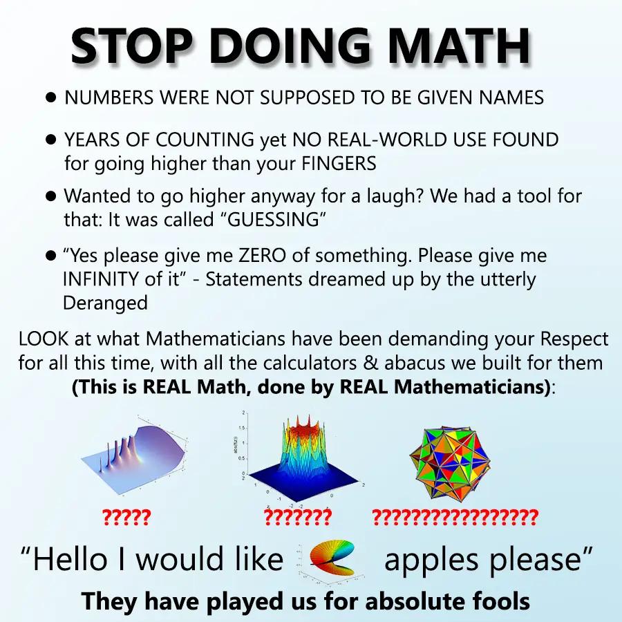

Math education is broken. Students sit through years of memorizing formulas and solving isolated problems that they forget within months of graduation. Students ask "when will I use this?" and teachers struggle to provide a compelling answer. It's time for a fundamental shift in how we approach mathematics education.

I propose a radical change. Instead of one mathematics course, schools should offer two distinct classes: pure mathematics and applied mathematics. This approach would match how students naturally learn, achieve the learning outcomes schools actually aim for, and more efficiently teach the true nature of mathematics.

## Pure Mathematics Class

### Beyond the Big Four

 by [Domain of Science](https://www.youtube.com/@domainofscience)")

Our current math curriculum is obsessed with algebra, geometry, trigonometry, and calculus. This obsession is a crime that deprives students of the wonder and creativity of mathematical thinking, causing them to believe that math boils down to factoring polynomials. Mathematics is far richer, diverse and fascinating than these four fields suggest. A pure math class should introduce students to the variety of mathematical concepts that exist beyond our narrow curriculum.

If you don't think math can be interesting, consider:
- Some numbers exist beyond our familiar number line. They can't be found in any integer, whether they're positive or negative, fractions, or decimals. These are imaginary numbers, and they're real numbers despite the contradictory name.
- There are many kinds of infinities, and not all are the same size; some infinites are bigger than others.
- [Fractals are beautiful and mesmerizing](https://youtu.be/LhOSM6uCWxk?si=Cceo80ygtZVaa3TG&t=56).
- The digits of pi contain every possible finite sequence of numbers: phone number, your birthday, even this entire sentence converted to numbers is somewhere in pi's decimal expansion.[^pi]
- According to number theory "1+2+3+4+5+... ∞ = -1/12". This math is real and used in string theory and physics.
- According to topology, donuts and mugs are the same structures.

These aren't just clever curiosities. they're profound insights into how our universe actually works, accessible only through mathematics. This is barely scratching the surface of what mathematics has to offer, and it sure is more captivating than solving for x.

### Concepts Over Computation

The fatal flaw in current math education is its obsession with problem-solving techniques. Students spend hours learning to factor polynomials, solve triangle problems, or integrate functions. This is factory knowledge meant to be applied to narrow tasks and those skills become obsolete the moment students leave school. It is quickly forgotten when not used for extensive periods of times, even by professionals.

Instead, pure mathematics should focus on understanding concepts and what they reveal about the fundamental nature of reality. When students grasp what infinity means, or why imaginary numbers exist, they're not just learning math, they're developing intellectual maturity and gaining insights into how the universe works.

Unlike factory knowledge, conceptual understanding lasts.

### Flexible Learning, Creative Thinking

Current math classes are rigid. Students must follow specific procedures to reach predetermined answers, but it is proven that students learn better in flexible environments. Since schools *allegedly* aims to educate students, a math class should embrace flexibility. Students should be encouraged to explore concepts from multiple angles, ask their own questions, and develop their own insights. Assessments should focus on understanding rather than mechanical execution.

Consider these alternative assignments:
- Give an oral presentation explaining a mathematical concept to prove your understanding.
- Write a short essay on what a particular mathematical idea reveals about the nature of reality.
- Generate and research three meaningful questions about a mathematical topic of your choice.
- Explain mathematical notation in plain language, since learning the symbols and their meanings is a crucial yet often overlooked skill.
- Put your comprehension of chaos theory to use by recreating or discovering interesting patterns in [Conway's Game of Life](https://conwaylife.com/).

Now, compare the previous flexible assignments with the following rigid assignments and notice how less engaging they seem:
- Factor 2 pages of polynomials.
- Find 15 quadratic functions given 2 points.
- Use trigonometric functions to find missing sides and angles of 30 triangles.
- Solve 20 logarithms.
- Calculate the volume of 8 complex shapes.

## Applied Mathematics Class

### Practical Applications, Real Impact

While pure math explores abstract beauty, applied math should tackle concrete, practical applications. 

This class would cover topics like:
- The applications of game theory in economics and decision-making.
- Probability and statistics for data-driven thinking.
- Cryptography, starting with simple ciphers and building to modern encryption.
- Mathematical modeling of real-world systems.

These aren't just academic exercises. Game theory governs everything from business negotiations to international diplomacy and even candy trading on the playground. We use its principles daily, often without realizing it. Students who understand these concepts gain practical tools for navigating life.

Applied mathematics also require students to learn about the real world. For example, one cannot use statistics without studying what they're measuring. If we're teaching students about sports analysis, it's crucial to understand how sports actually work. Edutainment YouTube channels like VSauce and Veritasium have gathered large audiences in the tens of millions for education presented as an interconnected web of knowledge. This dynamic approach both holds attention better and introduces students to subjects they might not otherwise encounter.

To learn more about this, I recommend watching VSauce's Tedx Talk on why we ask questions:



### Engagement Through Interaction

One of the most powerful teaching tools for applied math would be classroom simulations. Imagine playing variations of the [prisoner's dilemma](https://www.youtube.com/watch?v=K5TRstDfQDg) to explore game theory. Students make decisions, see outcomes, and naturally discover the mathematical principles at work. This kind of active learning is engaging, interactive, and immediately relevant. It creates lasting understanding.

### "When Will I Use This?"

When students ask about the relevance of cosines and tangents, they're right to be skeptical. Most people will never need to manually calculate trigonometric functions. Even programmers who work with these concepts regularly rely on reference materials and calculators.

Applied mathematics acknowledges this reality. It focuses on when and why you'd use these tools rather than memorizing formulas. Students learn to recognize situations where mathematical thinking applies, not just how to execute it.

## The Historical and Human Element

Both classes should weave-in mathematical history and the stories of mathematicians. Math has a rich tapestry of human drama:

- Pythagoras led a mathematical cult and supposedly died in a bean field while being chased by prosecutors. [^pythagoras]
- Georg Cantor's work on infinite sets was so controversial that fellow mathematicians called it a "disease" and "mathematical insanity." He suffered mental breakdowns partly due to the fierce opposition to his ideas, which are now fundamental to mathematics. [^georg]
- Numbers we know today, from 0 to 9, were called them demonic symbols of the Arabs by The Church, and some cities even banned them. [^arabic]
- Srinivasa Ramanujan was a self-taught Indian genius who claimed his theorems came to him in dreams from the goddess Namagiri. He filled notebooks with extraordinary formulas that mathematicians are still proving today. [^ramanujan]

These stories make math human. They show that mathematical concepts didn't emerge from nowhere, they were discovered by real people facing real challenges. For students who are more socially than technically inclined, these narratives provide crucial context and engagement. Students frequently comment on YouTube math history videos that learning about the historical context and mathematicians behind concepts helps them better understand the mathematics itself.

## Conclusion

Our educational system is broken, but that doesn't mean it's impossible to learn to love mathematics. Even if some of us had bad experiences in high school and we swear to be bad at math, it's still possible to self-educate while having fun.

Here are some of my favorite books and videos on the topic of math:

#### Joy of X

")

#### Group Theory



#### Imaginary Numbers



#### Lambda Calculus


#### Chaos Theory



#### Topology



#### Information Theory



[^pi]: If you found this factoid interesting, give the [Library of Babel](https://libraryofbabel.info/) a look. It would contain every possible combination of 1,312,000 characters, including lower case letters, space, comma, and period. Meaning that one of the books contains only your name written 10 times, followed by this sentence you are reading. Try looking for it in the [search](https://libraryofbabel.info/search.html) page!

[^pythagoras]: Riedweg, Christoph (2005) [2002]. Pythagoras: His Life, Teachings, and Influence. Ithaca, New York: Cornell University Press. ISBN 978-0-8014-7452-1.

[^georg]: Mancuso, Olivia (2024). Georg Cantor’s Controversial Career. Elephant Learning: https://www.elephantlearning.com/post/georg-cantors-controversial-career.
‌
[^arabic]: Abplanalp, Andrej (2020). How the Number 7 Came to Europe. Swiss National Museum - Swiss History Blog: https://blog.nationalmuseum.ch/en/2020/03/the-mathematician-fibonacci-or-how-the-number-7-came-to-europe/.

[^ramanujan]: Kanigel, Robert (1991). The Man Who Knew Infinity: a Life of the Genius Ramanujan. New York: Charles Scribner's Sons. ISBN 978-0-684-19259-8.
