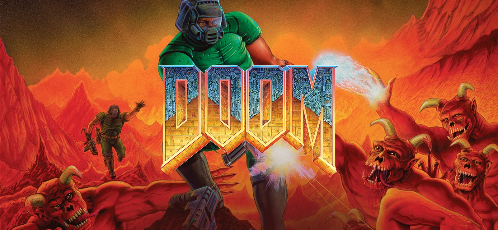

This is a guide on how to play Doom I and II on modern software, including all the mods.

## Issues With DOSBox

The original Doom and its sequel, Doom II, came out on DOS in 1993 and 1994 respectively. You are likely not using DOS anymore, in which case you are unable to launch the games on modern Windows, Mac or Linux.

To play old DOS games, we have [DOSBox](https://www.dosbox.com/). While Doom might be playable on DOSBox, the experience comes with the following disadvantages:

* Locked 4:3 320x200 resolution
* Hard coded 35 FPS
* [Engine bugs](https://doomwiki.org/wiki/Engine_bug)
* Funky mouse support
* Bad MIDI music player
* Limited modding support

Considering these major downsides, there are better, more modern ways of playing Doom. Since ID Software [open sourced the Doom engine](https://github.com/id-Software/DOOM), the community has been hard at work developing ports to break Doom's limitations, patch its bugs, support multiple platforms, and much more.

## WADs

By themselves, engines are not capable of much. They require game files (called IWADs) and optional mods (called PWADs). Below, we dive deeper into what they are and where to find them.

### IWADs

While the Doom engine's source code is open source, the assets are still under copyright and are owned by ID Software.[^1] Source ports are legally prohibited to distribute the game files, so you have to provide them yourself.

You can legally purchase the Doom game files from [Steam](https://store.steampowered.com/app/2280/DOOM__DOOM_II/) or [GOG](https://www.gog.com/en/game/doom_doom_ii). I recommend the latter, since GOG does not lock its products behind DRM.

Alternatively, pirating Doom I and II is very easy. While this blog does not promote piracy, the creators of Doom have admitted not being against it. The decision is ultimately yours.



If you are not willing to purchase or pirate the original game, [Freedoom](https://freedoom.github.io/) is a good option. Freedoom is a compatible, free/libre replacement for Doom I and II. Any mod requiring the original game will work with these community-made assets. Although, they look different from the original game.[^2]

### PWADs

Also called mods, they might not be necessary to enjoy the original Doom, but can greatly improve the experience with new maps, weapons, monsters, textures, music, and much more. You can start looking for quality mods at [doomwiki.org](https://doomwiki.org/wiki/Best_Doom_mods).

Keep in mind that not all mods are compatible with all ports. Some are designed for the original game while others utilize advanced features of modern engines.

* **Vanilla**

	Vanilla mods ending in `.WAD` are made for the original Doom and its limitations. Every engine can run these.

* **Limit-removing**

	Similar to vanilla, but without [engine limitations](https://doomwiki.org/wiki/Static_limits), such as maps being limited to 6 MB of RAM, or 128 rendered sprites or walls at once.

* **Boom**

	Boom-compatible mods ending in `.WAD` are designed for the Boom engine and its successors. Those engines are designed to remove engine limits, fix bugs, and implement new features.

* **ZDoom/GZDoom**

	Mods ending in `.PK3` are designed for the discontinued engine [ZDoom](https://zdoom.org/index), or its modern successor [GZDoom](https://zdoom.org/index). They are the most advanced engines with the [greatest availability of modern features](https://doomwiki.org/wiki/GZDoom#Features).
	
	Note that mods designed exclusively for GZDoom are not backwards compatible with ZDoom, but ZDoom mods are forward compatible with GZDoom.

* **DeHackEd**

	Files ending in `.DEH` represent patches to the original executable. These mods generally do not add content, but rather change values like hit points, sound, frame sequences, text strings, or others.
	
	They are supported by most engines.

> **Note:** This is not an exhaustive list. For example, there are mods designed for specific source ports like [Marine's Best Friend](https://doomwiki.org/wiki/MBF), but the ones mentioned above cover the vast majority of mods out there.

## Ports

Now, let's explore my top picks of engines to cover all mod types listed above and to present a wide variety of different ways to experience Doom.

### Chocolate Doom

[Chocolate Doom](https://www.chocolate-doom.org/wiki/index.php/Chocolate_Doom) aims to emulate an experience as close to the original as possible. Playing Chocolate Doom is comparable to playing on DOSBox while being easier to configure and to use.

It only supports vanilla WADs.

While the experience is faithful, all the downsides mentioned earlier still apply. For a classic and comfortable experience, I recommend the next source port.

### Crispy Doom

[Crispy Doom](https://www.chocolate-doom.org/wiki/index.php/Crispy_Doom) is a friendly fork of Chocolate Doom that provides a higher display resolution, removes the static limits of the Doom engine and offers further optional visual, tactical and physical enhancements while remaining compatible with the original. 

It still is limited in terms of modding, as it can only play vanilla and limit-removing WADs.

### Doom Retro

[Doom Retro](https://www.doomretro.com/) is the latest descendent of [Boom](https://doomwiki.org/wiki/Boom), a historically significant port. Boom removed important bugs and limitations, provided engine optimizations, and implemented [new features](https://doomwiki.org/wiki/Boom#Features) now found in most modern source ports. Yet, Boom and Doom Retro maintain a traditional experience.

It supports most WADs, including vanilla, limit-removing, and boom-compatible, but does not support (G)ZDoom's PK3s.

### GZDoom

[GZDoom](https://www.zdoom.org/downloads) is a modern source port that offers extensive enhancements over the original Doom engine. It supports advanced graphical features, improved modding capabilities, and a more customizable experience.

Mods designed for GZDoom tend to be the most impressive since they have access to the engine's scripting languages (ZScript and Decorate), post-processing, 3D models, dynamic lights, and much more. For a greatly impressive mod, consider [Comatose](https://doomwiki.org/wiki/Comatose).

GZDoom allows for the use of `.PK3` files and every mod type mentioned before. Its modern features, ease of use, and customizability make it a top choice for many players.

Despite its current status as the go-to source port, using it has some downsides. The most notable one, in my opinion, being the overwhelming customization. A common criticism of the port is its poor default settings which include unusual controls and blurry sprites. The settings menu to change those can feel intimidating.

### Honorable Mention: Zandronum

[Zandronum](https://zandronum.com/) is a modern multiplayer port. It supports most features of (G)ZDoom, up to 64 players, and multiplayer game modes like capture the flag or deathmatch.

[^1]: Doom was originally distributed as [shareware](https://en.wikipedia.org/wiki/Shareware), and thus the assets and levels of the first chapter of Doom I can be legally distributed. Although, most mods require either Doom II or the full version of Doom I.

[^2]: Fun fact, Doom was [allegedly](https://www.gamepressure.com/editorials/aliens-metallica-and-gabe-newell-7-things-you-didnt-know-about-do/doom-was-supposed-to-be-a-sandbox-sort-of/zc264) supposed to be released under the Alien franchise before ID Software decided to maintain creative freedom. Freedoom's art direction aims to recapture that.
